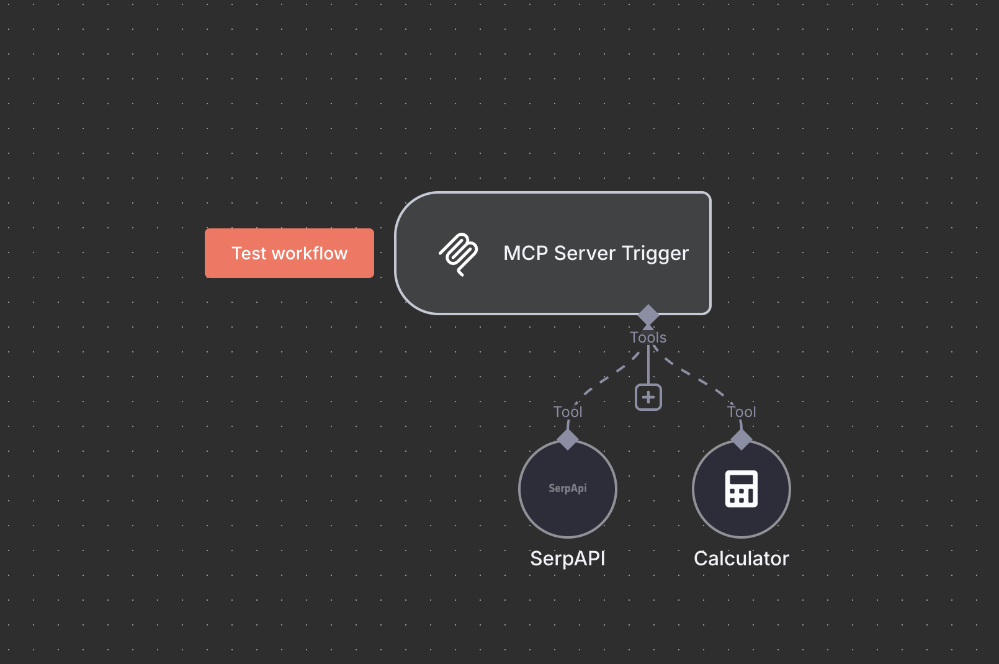
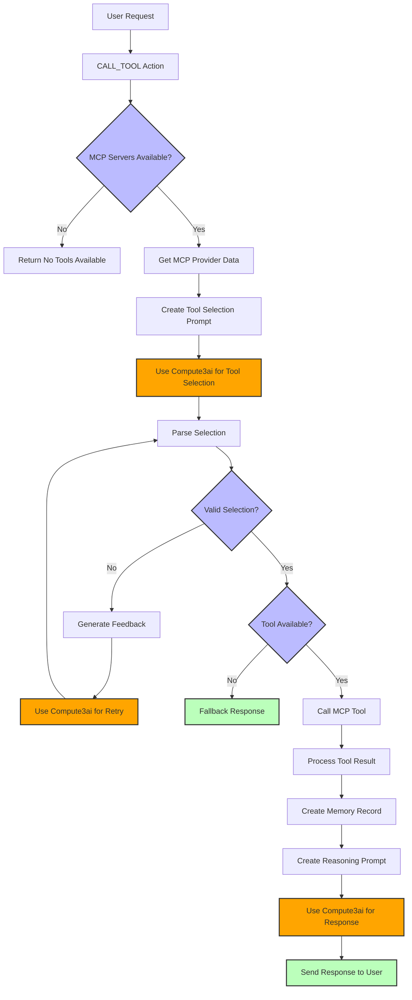

# Comput3AI MCP Plugin

A powerful integration plugin that bridges ElizaOS with the Model Context Protocol (MCP), enabling your AI agents to harness multiple MCP servers for enhanced capabilities.

## 🌟 Overview

The [Model Context Protocol](https://modelcontextprotocol.io) (MCP) is a revolutionary open protocol that creates a seamless bridge between Large Language Models (LLMs) and external resources. It standardizes how AI applications interact with external data and tools, making integration simple and efficient.

## ✨ Key Features

This plugin supercharges your ElizaOS agents by providing access to multiple MCP servers, each offering unique capabilities:

- **Smart Resources**: Access and utilize contextual data and information
- **Dynamic Prompts**: Leverage templated messages and workflows
- **Powerful Tools**: Execute sophisticated functions and operations

## 🚀 Getting Started


create an account on 
https://comput3.ai/

top up your account and launch gpus

get your eliza agent on 
```bash
git clone https://github.com/elizaos/eliza-starter.git
cd eliza-starter
cp .env.example .env
pnpm i && pnpm build && pnpm start
```

add compute3 configurations to the .env file.

OPENAI_API_KEY=c3_api_key
OPENAI_API_URL=https://api.comput3.ai/v1
SMALL_OPENAI_MODEL=hermes3:70b
MEDIUM_OPENAI_MODEL=hermes3:70b
LARGE_OPENAI_MODEL=hermes3:70b

To integrate this plugin into your ElizaOS project:

## 📦 Installation

Install the plugin in your ElizaOS project:
```bash
packages/
├─plugin-comput3ai-mcp/    # Your plugin directory
   ├── package.json
   ├── tsconfig.json
   ├── src/
   │   ├── index.ts        # Main plugin entry
   │   ├── actions/        # Custom actions
   │   ├── providers/      # Data providers
   │   ├── types.ts        # Type definitions
   │   └── environment.ts  # Configuration
```
1. Clone the repository:
```bash
cd packages
git clone github:comput3ai/plugin-comput3ai-mcp
```

- **npm**

```bash
npm install @compute3ai/plugin-compute3ai-mcp
```

- **pnpm**

```bash
pnpm install @compute3ai/plugin-compute3ai-mcp
```

- **yarn**

```bash
yarn add @compute3ai/plugin-compute3ai-mcp
```

- **bun**

```bash
bun add @compute3ai/plugin-compute3ai-mcp
```

## 🚀 Usage

1.deploy and mcp server 
 - examples can be found here https://github.com/modelcontextprotocol/servers/
 
 - or you can use https://n8n.io/

 

2. Add the plugin to your character configuration:

```json
{
  "name": "Your Character",
  "plugins": ["@compute3ai/plugin-compute3ai-mcp"],
     "settings": {
        "mcp": {
            "servers": {
                "n8n": {
                    "name": "n8n",
                    "type": "sse",
                    "command": "npx",
                    "args": [
                    "-y",
                    "supergateway",
                    "--sse",
                   "https://comput3ai.app.n8n.cloud/mcp/tutorial/sse"],
                   "url": "https://comput3ai.app.n8n.cloud/mcp/tutorial/sse",
                   "timeout": 10000,
                   "interval": 10000,
                   "max_retries": 3,
                   "retry_delay": 1000
                }

            }
          },
    }
}
```

## ⚙️ Configuration Options

MCP supports two types of servers: "stdio" and "sse". Each type has its own configuration options.

### Common Options

| Option     | Type    | Description                                     |
| ---------- | ------- | ----------------------------------------------- |
| `type`     | string  | The type of MCP server: "stdio" or "sse"        |
| `name`     | string  | The display name of the server                  |
| `timeout`  | number  | Timeout in seconds for tool calls (default: 60) |
| `disabled` | boolean | Whether the server is disabled                  |

### stdio Server Options

| Option    | Type     | Description                                       |
| --------- | -------- | ------------------------------------------------- |
| `command` | string   | The command to run the MCP server                 |
| `args`    | string[] | Command-line arguments for the server             |
| `env`     | object   | Environment variables to pass to the server       |
| `cwd`     | string   | _Optional_ Working directory to run the server in |

### sse Server Options

| Option    | Type   | Description                            |
| --------- | ------ | -------------------------------------- |
| `url`     | string | The URL of the SSE endpoint            |

## 🛠️ Using MCP Capabilities

Once configured, the plugin automatically exposes MCP servers' capabilities to your agent:

### Context Providers

The plugin includes three providers that add MCP capabilities to the agent's context:

1. `MCP_SERVERS`: Lists available servers and their tools, resources and prompts

## 🔄 Plugin Flow

The following diagram illustrates the MCP plugin's flow for tool selection and execution:



## 📋 Example: Setting Up Multiple MCP Servers

Here's a complete example configuration with multiple MCP servers of both types:

```json
{
  "name": "Developer Assistant",
  "plugins": ["@elizaos/plugin-mcp", "other-plugins"],
  "settings": {
    "mcp": {
      "servers": {
        "github": {
          "command": "npx",
          "args": ["-y", "@modelcontextprotocol/server-github"],
          "env": {
            "GITHUB_PERSONAL_ACCESS_TOKEN": "<YOUR_TOKEN>"
          }
        },
        "puppeteer": {
          "command": "npx",
          "args": ["-y", "@modelcontextprotocol/server-puppeteer"]
        },
        "google-maps": {
          "command": "npx",
          "args": ["-y", "@modelcontextprotocol/server-google-maps"],
          "env": {
            "GOOGLE_MAPS_API_KEY": "<YOUR_API_KEY>"
          }
        }
      },
      "maxRetries": 2
    }
  }
}
```


## 🔒 Security Considerations

Please be aware that MCP servers can execute arbitrary code, so only connect to servers you trust.

## 🔍 Troubleshooting

If you encounter issues with the MCP plugin:

1. Check that your MCP servers are correctly configured and running
2. Ensure the commands are accessible in the ElizaOS environment
3. Review the logs for connection errors
4. Verify that the plugin is properly loaded in your character configuration

